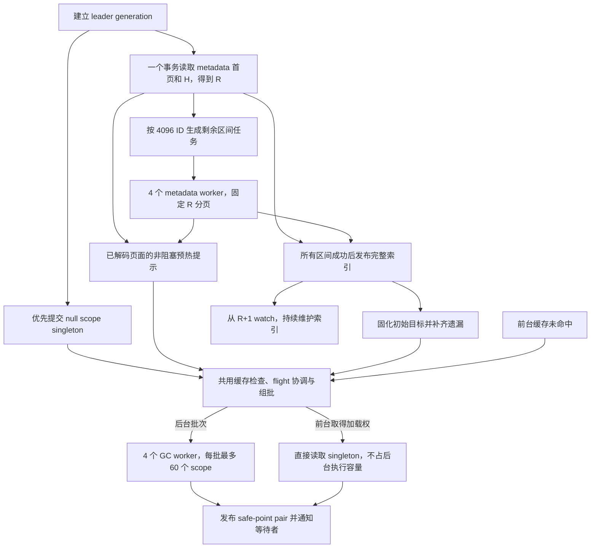

# GC 状态缓存批量加载与主动预热设计

本文为 [issue #11311](https://github.com/tikv/pd/issues/11311) 提供独立实现方案：通过共享冷读协调、批量读取 safe point，以及与 keyspace 元数据加载并行的后台预热，降低 leader 切换后的重复读取和首次加载开销。

设计复用 [PR #11264](https://github.com/tikv/pd/pull/11264) 的 enabled-keyspace cache，但不依赖 WatchGCStates RPC、协议或流实现。实现以 `master` 为基础单独提交 PR；#11264 后续 rebase 到本 PR 并复用这些能力。

状态：设计 review 已完成，两位独立 reviewer 复核通过，用户已确认并授权 sub-agent 顺序实现，由主 agent 驱动。详见[设计评审记录](gc-cold-loads-11311-review.md)。代码基线为 `3917c36a337bfa3dcd8df7baba83e33865710a35`，参考 #11264 的版本为 `69b3171250dd620e682a4d9058e725f95f6e1cc1`，核对日期为 2026 年 9 月 29 日。

## 1. 问题与目标

当前 [`getGCStateImplSlow`](../../pkg/gc/gc_state_manager.go) 在 manager 读锁内再次检查缓存。多个并发请求可以同时发现同一个 scope 未缓存，随后重复访问存储。读锁能够排斥本地 GC 写操作，但不会合并多个读请求。

现有不含 barriers 的单个冷读大致需要四次 RPC：读取 PD GC revision、读取 transaction safe point、读取 GC safe point、通过事务校验 GC revision。即使仅消除同一 scope 的重复读取，K 个不同 scope 的首次加载仍需要约 `4K` 次 RPC。

本方案同时处理三个目标：

1. 对参与协调的前台冷读和后台预热，同一 leader 任期内同一 GC scope 只保留一个正在执行的加载。
2. 将最多 60 个 scope 的两个 safe point 放入同一个只读事务，每批只发送一次 RPC。
3. leader 就绪后在后台预热，并让元数据扫描与 GC 状态读取重叠执行，避免前台初始化逐条承担全部冷读成本。

成功条件是既有 GC API 的返回语义、一致性边界和 leader 切换行为得到保留；PD 就绪和未来 Watch 初始化都不等待全部 GC 缓存预热完成。

## 2. 范围与固定参数

本 PR 引入通用批读和冷读协调；enabled-keyspace 索引及主动预热仅在 NextGen 启用。

| 项目 | 首版约定 |
| --- | --- |
| 元数据首页 | 一个只读事务同时读取最多 256 条 metadata 和可选的 allocator watermark H |
| 元数据任务粒度 | 4096 个可能的 ID；不是 4096 条返回记录 |
| 元数据扫描并发 | 4 个 worker，通过有界 channel 动态领取任务 |
| 元数据每页 | 最多 256 条；整个快照固定在 revision R |
| GC 批量读取 | 每批最多 60 个实际需要读取的 scope，共最多 120 个精确 Get |
| GC 预热并发 | 独立的 4 个 worker；首版使用内部设置，不新增公开配置项 |
| 主动预热时机 | 每个 leader 任期的首次元数据快照构建期间及其未完成工作的恢复 |
| 后续 metadata 变化 | 继续维护索引；新增、重新启用和 GC 模式变化按需加载 |
| 缓存检查 | 共用 fill 入口一次检查，预热器不做额外缓存预筛选 |
| 缓存发布保护 | 每批从存储读取至缓存发布一直持有 manager 读锁，批间释放 |

本 PR 不包含 Watch 注册、初始流发送、实时广播、Watch 专属指标或协议变更；也不实现混合 range 读取和全量 safe-point 前缀扫描。已有包含 barriers 的读取及 legacy 入口保留原协议。

## 3. 术语与模块边界

本设计使用以下术语；GC 领域基础词汇另见 [CONTEXT.md](../../CONTEXT.md)。

| 术语 | 含义 |
| --- | --- |
| GC scope | 一个独立 GC 管理范围：keyspace-level GC 的 keyspace，或 unified GC 共享的 null scope |
| safe-point pair | 同一 scope 的 transaction safe point 与 GC safe point；本次缓存和批读只包含这两个值 |
| H | etcd 中 `keyspaces/alloc_id` 保存的已预留 ID 窗口上界；仅用于停止细分扫描任务 |
| R | 初始 metadata 只读事务响应头中的 etcd MVCC revision，用于固定元数据快照 |
| PD GC revision | GC 元数据协议维护的应用层计数，与 etcd MVCC revision 不同 |
| generation | 一次 leader 任期的唯一身份；不能复用现有 leadership 计数的数值 |
| flight | 某一 generation 内，一个 scope 正在执行的加载及其完成通知 |
| 初始预热任务 | 一次 leader 任期内的初始候选、执行和恢复过程；完成后不随实时索引扩张 |

各模块通过明确的输入和完成条件衔接：

| 模块 | 职责与接口约束 |
| --- | --- |
| `pkg/storage/kv` | 为新批读提供可传入 context 的原始事务执行能力，并保留请求超时；既有调用方式保持兼容 |
| `pkg/storage/endpoint` | 提供 GC 专用 safe-point 批读方法，输入 context 和有效 scope IDs，返回成功的 pair 及对应读取/解码错误；隐藏 key 布局和编码 |
| `pkg/gc` 元数据索引 | 抽取 #11264 的初始加载、完整快照发布、metadata watch 与进度规则；增加并行区间扫描和初始页提示 |
| `pkg/gc` fill 协调 | 将前台 singleton 与后台 batch 接入同一缓存检查、flight 所有权和完成通知协议 |
| `pkg/gc` 预热器 | 管理初始候选、批次装配、4 个 GC worker、遗漏补齐、重试及完成状态 |
| manager 与 cluster 生命周期 | 创建 generation，按部署模式启用后台任务，返回只清理本任期的 teardown 函数 |

方法名、内部文件拆分等局部细节在实现计划中确定；本文中的容量、一致性和生命周期约束是实现必须满足的契约。

## 4. 整体流程

leader 获取成功后立即启动后台任务，优先为 NullKeyspaceID 发起一次独立的 singleton 预热，与 metadata 加载并行。它的两个存储路径已知，无需等待 metadata；metadata 扫描和其他 scope 的预热也不等待它完成。该 singleton 复用共用 fill 入口，并占用四个后台执行名额之一，不增加专属 worker；缓存已命中或已有 flight 时按共用协议处理，不重复读取。



元数据扫描和 GC 读取使用两个独立 worker pool。元数据发现先于对应 scope 的 GC 读取，但不同页面可以并行推进。元数据索引只有完整加载成功后才 ready；已加载页面可以提前触发 GC 读取。

## 5. 预热对象与范围

候选来自 keyspace metadata，而不是已存在的 safe-point 记录。一个 enabled keyspace 可能尚未保存 safe point；一个已停用 keyspace 也可能残留存储记录。

| 对象 | 处理方式 |
| --- | --- |
| NullKeyspaceID | 初次优先独立发起 singleton 预热；复用共用 fill 协调，metadata 扫描不会返回它 |
| ENABLED 且 `gc_management_type == keyspace_level` | 加入独立 GC scope |
| ENABLED 且使用 unified GC，包括未配置 GC 管理类型 | 共享 null scope，不重复读取另一对 safe point |
| DISABLED、ARCHIVED、TOMBSTONE | 不主动预热 |
| 已缓存或已有 flight 的 scope | 在共用入口命中或协调，不重复读取 |

索引保留所有 ENABLED keyspace 及其 GC 模式，包括 unified GC，供后续消费者使用；预热候选只选择独立 GC scope。Default keyspace 与 null scope 不同，DEFAULT 和 SYSTEM 均按实际 metadata 处理。

NullKeyspaceID 是 `0xFFFFFFFF`，超出普通 keyspace 的合法 ID 范围 `[0, 0xFFFFFF]`，代表没有具名 keyspace 的共享 GC scope，没有对应的普通 metadata 记录。第 6.2 节的 `[cursor, prefixEnd)` 是 metadata key 前缀内的字典序区间，只枚举实际存在的 metadata key，不会生成 null scope。其 safe points 使用 `/pd/{cluster}/gc/safe_point` 和 `/tidb/store/gcworker/saved_safe_point` 两条 legacy 路径，因此需要显式加入候选。[ID 定义](../../pkg/keyspace/constant/constant.go)、[路径选择](../../pkg/utils/keypath/gc_states.go)及现有 `iterateAllKeyspacesGCStates` 对 null scope 的单独枚举共同体现这一语义。

Metadata 在预热期间仍可变化。较早的提示可能导致一次后来已不必要的 GC 读取，但不能改变 API 的路由或成员过滤。GC safe point 在各批当前事务快照读取，不固定在 metadata 的 R。

## 6. Keyspace metadata 的并行加载

metadata key 为 `/pd/{cluster}/keyspaces/meta/%08d`。合法 keyspace ID 是 24 位范围 `[0, 0xFFFFFF]`，固定宽度编码使 key 的字典序与 ID 数值顺序一致。

### 6.1 首次事务与 H 的含义

首次请求包含两个默认线性一致的 Get，不设置 `WithSerializable()`，也不指定历史 revision：

```text
Txn.Then(
    Get(metadataPrefix, range=prefixEnd, limit=256),
    Get(allocatorKey),
)
```

请求成功后，从顶层 `TxnResponse.Header.Revision` 取得 R，从 metadata 子响应取得 `More`。直接使用元数据索引持有的 etcd client，避免当前 `RawTxnResponse` 丢失 revision 和 `More`。

[ID allocator](../../pkg/id/id.go) 将已预留窗口的上界以 8 字节大端 uint64 保存到 [`keyspaces/alloc_id`](../../pkg/utils/keypath/absolute_key_path.go)。Keyspace 分配步长为 100，H 可能领先于实际成功创建的 keyspace；显式 `CreateKeyspaceByID` 不推进 H，SYSTEM 位于高 ID 保留区。因此 H 不能作为扫描上界，也不是精确的最大已用 ID。读取 H 不调用 `Alloc` 或 `Rebase`，不改变分配器状态。

H 缺失或不可用时，仍保留已读首页，按同一 R 顺序扫描全部剩余区间。首版仅将可解码且不超过 `MaxValidKeyspaceID` 的 H 用作划分提示；其他数值直接回退，计算区间边界时使用足够宽的整数，避免溢出。不能因提示异常而漏扫 metadata。

### 6.2 首页与滚动派发

一个加载尝试按以下顺序执行：

1. 完整解码并保留首页，再发出该页的 GC 预热提示。
2. 如果 `More == false`，首页就是完整快照，直接发布。空前缀、不足 256 条和恰好 256 条都属于该分支，不启动区间 worker。
3. 如果 `More == true`，首页必须非空。设置精确续读位置 `cursor = lastReturnedKey + "\x00"`。
4. 将 ID 空间概念上划为 `[0,4096)`、`[4096,8192)` 等半开区间。跳过首页已完全消费的区间，首个未完成区间从精确 cursor 开始。
5. 对下一候选区间的 ID 上界 b，若 `b < H`，派发 `[cursor, metadataKey(b))`，并推进 cursor；若 `b >= H`，直接派发 `[cursor, prefixEnd)` 并结束派发。H 仅决定何时停止细分，不在 H 或 H+1 处额外切分。
6. 若首页已达到 H，或 H 不可用，直接以 `[cursor, prefixEnd)` 作为唯一剩余任务。

例如 H 为 10000 时，概念任务是 `[0,4096)`、`[4096,8192)`、`[8192,prefixEnd)`，实际扣除首页已读部分。H 恰好为 8192 时，候选 `[4096,8192)` 直接扩展为 `[4096,prefixEnd)`，自然包含 ID 为 8192 的记录。

任务按递增区间顺序滚动写入有界 channel，4 个 worker 完成当前区间后领取下一个。派发最终任务只需等待 channel 容量，无需等待前面全部任务结束。生产者负责关闭 channel，不预先构建全部任务描述。

每个 worker 在自己的 `[start,end)` 内以最多 256 条一页向前读取，页内使用 `WithRev(R)`。4096 表示可能的 ID 数，不是单次 RPC 的返回条数。最终任务一直覆盖到 metadata 前缀末尾，包括高于 H 的显式 keyspace 和 SYSTEM。数值上的大空洞由 range 扫描跳过，不逐个 ID 点查。

### 6.3 快照、一致性与取消

首页与剩余任务必须连续、不重叠地覆盖整个前缀。各 worker 解码到未发布的快照状态；并发合并必须同步，或使用各任务私有结果后统一合并。metadata 锁不跨存储 I/O 或 channel 等待。

全部区间成功后，原子发布完整索引及 revision R，再从 R+1 建立 watch。后续分页的 response header 即使较新，也不能替换 R。watch 保留 #11264 的 pending 更新与 progress publication 规则，不能因单个事件到达就声称该 revision 已完整应用。

生产者和 worker 使用派生自 leader 生命周期的加载尝试 context。任一页读取或解码失败时，取消本次生产者和其余扫描 worker，等待退出后丢弃未发布快照，再通过既有重试路径重新加载。发送和接收任务均观察取消，避免满 channel 阻塞退出。R 被 compact 后，重新取得共同的新 R 并重建完整快照。

## 7. Safe point 的批量读取

GC 专用存储方法接收至多 60 个有效 scope ID，对每个 scope 添加两个精确 Get，并直接提交一次只读 `RawTxn`。空输入不发送事务，重复 scope 由协调层归一；存储方法必须拒绝超出单批约定的请求，避免隐式产生无界大事务。

当前 key 布局为：

```text
GC safe point:  /pd/{cluster}/keyspaces/gc_safe_point/{8 位补零 ID}
Txn safe point: /keyspaces/tidb/{ID}/tidb/store/gcworker/saved_safe_point
```

Null scope 使用已有 legacy 路径。编解码复用当前规则：unified GC safe point 为十六进制，keyspace GC safe point 为 JSON，transaction safe point 为十进制。缺失 key 或成功读取到已存在的空字符串，都沿用当前 reader 的零值语义；非空值的解码错误、响应结构异常和读取失败均不能转换成零。空字符串兼容性适用于三个现有 reader，不能因新事务接口可以区分“缺失”和“空值”就改变行为。

项目事务操作预算为 120，故两个 Get 一个 scope 的上限为 60。所有 pair 都来自同一个原子事务快照，不再通过 `RunInGCStateTransaction` 包裹，也不增加单独的 PD GC revision 读取或比较。若只是把多个 scope 的逐次 Get 包在既有 wrapper 中，仍需约 `2B+2` 次 RPC，无法达到本设计的一批一次 RPC。

etcd MVCC revision 已包含在事务响应头中，但 GC 缓存只需 safe-point pair，不要求扩展 `RawTxnResponse` 来返回它。不同 GC 批次可以读取不同的当前快照。包含 barriers 的路径继续使用自身完整校验协议。

新事务执行路径必须接收调用方 context，并叠加已有请求超时。后台批次绑定 leader generation；前台发起的共享加载不能只绑定某个等待者的取消。单个调用者放弃等待不会取消其他调用者仍需要的加载。

一次传输失败使该批所有 scope 失败。事务返回后按 scope 解码，允许健康 pair 成功发布、仅失败 scope 进入错误及重试处理；无论结果如何都必须结束各自 flight。这样一个损坏记录不会长期阻塞同批健康 scope。

## 8. 共用 fill 入口与并发协议

缓存命中保持轻量路径。进入共用 fill 的候选以有效 GC scope 为键，unified GC 使用 NullKeyspaceID。

### 8.1 入口覆盖

共享协调仅覆盖以下路径，不承诺合并所有读取 safe point 的 API：

| 入口 | 本 PR 的处理 |
| --- | --- |
| Leader 上的 `GetGCState(id, true)` | 保留 fast path，缓存未命中进入共用 fill |
| Leader 上的 `GetAllKeyspacesGCStates(ctx, true)` | 保留 `OrderedSingleFlight`、枚举和过滤；缺失项通过 `getGCStateImpl` 进入共用 fill |
| 后台预热 | 将候选批次直接交给共用 fill |
| 包含 local/global barriers 的读取 | 保留原存储读取及 revision 校验边界 |
| Follower 读取、`CompatibleLoadGCSafePoint` | 保留既有读取路径，不参与依赖 leader 缓存的 flight 等待循环 |

`GetGCStateWithGlobalGCBarriers` 即使设置 `excludeGCBarriers=true`，仍需把 safe points 和 global barriers 放在同一个 revision 校验范围内。不能用先前缓存或另一 flight 的 pair 拼接后来读取的 global barriers。缓存命中免除的是 safe-point 存储读取，keyspace 路由及枚举仍可能读取 metadata。

### 8.2 过滤后组批

预热器按已解码页面提交有界候选列表，共用入口只进行一次缓存检查，并检查或登记 flight。只有实际未缓存、且由当前批次取得加载权的 scope 才计入 60 个名额。

缓存命中、已有 flight 或重复候选均不占批次名额。装配继续从已经可用的候选中补充，允许跨已到达的页面列表凑批。不能先截取 60 个输入再过滤并立即发送一个较小批次。

多个 worker 使用共享的批次装配临界区，避免各自拿走少量候选就提前发送不足批次。可用候选耗尽后立即发送当前不足批次，不等待未来页面；空批次不发送。前台 singleton 不等待后台队列、满批或整个预热过程，只能加入已经运行的本 scope flight，或立即取得自己的加载权。

启动时的 null scope 是明确的首次 singleton 任务，不向其中补入 metadata 候选。若这次加载失败，后续恢复回到共用重试和组批流程；成功后不再主动重复预热。

例如同时已有 120 个候选，其中 60 个命中缓存、60 个缺失，必须装成一个 60-scope 事务。独立到达的一页 256 个缺失 scope 则可以发送 `60+60+60+60+16` 五个事务；下一页已经可用时继续补齐末批。

### 8.3 锁顺序与完成协议

后台执行容量先于 scope 占用取得，不建立“已占用 scope、尚在等待 worker”的批次队列。一个 worker 负责本批从持锁读取到缓存发布，manager 读锁不跨 goroutine 转交。

锁和资源顺序如下：

```text
组批：后台执行容量 → assembly mutex → manager RLock → flight mutex → cache shard lock
完成：manager RLock → flight mutex → cache shard lock
前台：manager RLock → flight mutex → cache shard lock
```

assembly mutex 只序列化候选消费和组批，在存储 I/O 前释放。flight mutex 是另一把短期锁，保护“检查一次缓存并查询/登记 flight”和“发布结果并结束 flight”这两组操作。若仅靠 manager 读锁，可能出现检查 miss 后另一个 reader 发布并移除 flight、当前 reader 又登记并重复读取的竞态。

manager 读锁从该批检查 generation 和缓存起，覆盖存储读取与发布；批间释放。flight mutex 和 shard lock 均不跨 I/O。完成、失败和取消路径不依赖 assembly mutex，必须结束 flight 并唤醒全部等待者。删除 flight 时同时校验 generation 和 flight 身份，旧回调不能清理新任务。

等待 flight、metadata、channel 容量或后台执行容量时不持有 manager 锁；等待 flight 时也不持有任何 assembly、flight 或 shard 锁。持有 manager 锁期间只非阻塞消费已经可用的候选。禁止持 flight mutex 获取 manager 锁，以及持 shard lock 获取 flight mutex。

`RLock()` 本身不可通过 context 取消，因此获得锁后必须再次检查取消和 generation，再开始 I/O。前台成功等待者重新检查当前缓存，不直接返回旧任期的 flight payload；失败等待者得到该次错误，后续请求可以重试。后台等待者消费匹配 generation/flight 的终态：一旦收到成功通知就记录该 scope 已完成，不因醒来时缓存已失效而再次预热；失败才保留待恢复状态。后台完成通知无需携带供 API 返回的旧 pair。

### 8.4 与写入及失效的关系

manager 读锁保护本批读取与发布不被本地 GC 写入、失败写入失效和 leadership reset 插入。例如，不能允许预热读到 100 后，writer 写入 200，而预热又将缓存覆盖为 100。缓存自身 shard 锁只能保护单次 map 操作，无法单独提供这一保证。

该保护不冻结 keyspace metadata。`GetAllKeyspacesGCStates` 现有的 metadata 驱动缓存清理位于 manager 锁外，仍可能与回填交错；API 的路由和成员过滤决定最终返回哪些状态。一次成功预热后的缓存失效不会重新加入主动预热。

最多四个后台 batch 可同时持有读锁。GC writer 等待当前 readers 退出；Go RWMutex 在 writer 等待后阻止新 reader 插队。批次超时、取消与批间解锁共同限制等待，但并发增加仍可能扩大 etcd 争用，不能把四并发视为四倍吞吐保证。

## 9. 初始预热、遗漏补齐与失败恢复

页面提示是非阻塞建议。metadata 页完整解码后才能发出提示；若有界预热队列已满，记录需要补齐即可，不能阻塞扫描，也不能为每个遗漏 ID 创建 goroutine。

首个成功发布的完整 metadata 快照确定初始目标集合。预热器保留紧凑的目标 IDs、待完成状态和完成记录，补齐页面提示遗漏的目标。已经由页面提示成功处理的 scope，包括首次快照发布前完成的 scope，必须记录为完成，不能仅靠“现在还在不在缓存”判断是否需要重做。

目标集合固化后，live metadata index 继续变化，但不能把新增、重新启用或切换为独立 GC 的 scope 纳入当前预热任务。重试时可跳过已不再有效的原目标；已完成目标的后续失效由前台加载处理。

后台失败按退避策略重试，并继续调度其他健康目标。重试与首次加载共用四并发限制和批量装配，不能因恢复路径退化为逐条 Get。传输失败不发布该批结果；解码失败只阻止损坏 scope 成功；scope 已由其他 flight 占用时，预热器跟踪其完成结果，失败后仍保留待恢复状态。

若初始 metadata 尝试后续页面失败，丢弃未完成索引，但保留已经成功发布的同任期 GC 缓存和完成记录。元数据重新完整加载前仍属于初始发现过程。首个完整快照之后的 watch 失败或 compaction 只重建 metadata，不启动新预热任务、不扩张原目标集，也不清除有效的同任期 GC 缓存；原目标尚未恢复的错误继续自行重试。

初始目标全部成功处理或确认不再需要后，关闭初始提示接收并退出 GC worker pool，释放临时集合；metadata 同步继续运行。GC 读取缓慢、队列饱和和重试都不能成为 metadata ready 或 progress publication 的前置条件。

## 10. Leader 生命周期

沿用 #11264 的 active generation 模型，替换 master 中以 leadership 加减计数判断缓存使用资格的方式。每次获取领导权时创建唯一 generation，先禁用缓存快读，重置缓存及本任期状态，再发布新的 active generation，最后按 NextGen 配置启动 metadata 同步和 GC 预热。缓存快读和共用 fill 都以 active generation 为准；重置尚未完成时不得返回此前 follower 或旧任期留下的缓存。generation 身份不能由可重复出现的计数值充当。

`OnNodeBecomesLeader` 返回捕获本 generation 的幂等清理函数，由 cluster 保存并在退出时调用。停止时通过匹配 generation 的原子操作禁用该任期的缓存使用资格，并立即取消其任务，再等待 manager 写锁；锁内再次核对待清理状态的任期归属，仅清理本任期拥有的状态。替换仍存在的旧任期时，同样先禁用和取消旧任期，再等待写锁重置新任期。等待 goroutine 退出时不能持有其完成路径需要的锁。延迟到达的旧清理函数可以取消自己的任务，但不能禁用或取消新 generation、清空新缓存或删除新 flight。

即使取消已发出，发布前仍要核对 generation 和任务状态。单个前台等待者的取消只终止自己的等待；generation 取消才终止该任期共享加载。新批读路径支持取消与超时，不要求重写所有既有 GC API 和迭代器的 context 传递。

## 11. 独立 PR 与后续 Watch 集成

从 #11264 抽取 [`enabled_keyspace_cache.go`](https://github.com/tikv/pd/blob/69b3171250dd620e682a4d9058e725f95f6e1cc1/pkg/gc/enabled_keyspace_cache.go)及对应测试、manager 的通用 etcd client/index wiring、generation 清理和 cluster 回调衔接。这些能力无需 GCStateWatcher、流广播或协议变更即可独立构建和运行。

本 PR 合入后，#11264 rebase 并移除重复基础设施，保留 Watch 专有逻辑和测试。Watch 仍需先注册，再读取当前受维护的状态，并保留 initial/live 事件顺序及 metadata freshness 条件；不能把某次注册前的预热快照直接当成完整初始结果。GC 缓存无需全部 ready，后续 Watch 可以逐批加载、逐批发送。

实现按以下模块边界组织，主 agent 负责接口衔接、集成和验收，sub-agent 负责授权范围内的实现：

| 实现单元 | 主要交付 | 依赖 |
| --- | --- | --- |
| 存储批读 | 可取消的事务路径、60-scope 批读、编码与错误语义测试 | 既有 storage/kv 与 endpoint |
| 元数据索引 | 从 #11264 抽取索引，增加首页事务、4096 区间调度和四并发扫描 | 既有 etcd client 与 keyspace 布局 |
| 共享加载与预热 | flight 协调、过滤后组批、四并发预热、初始目标与恢复 | 存储批读及 metadata 页/快照通知 |
| 生命周期与集成 | NextGen wiring、generation 清理、跨模块并发和回归测试 | 前述模块 |

根据用户确认，所有 sub-agent 任务顺序执行，不并行派发。主 agent 明确接口与文件所有权，排定共享加载、预热和生命周期的依赖顺序，每个任务实现、验证和 review 后再推进下一项。后续实现计划遵守这些边界和验收条件。

## 12. 方案取舍与成本

精确点查适合首版，因为一次批读的 key 数量和响应体积受目标 scope 数约束，稀疏 ID 和 singleton 均可使用同一方法。

| 备选方案 | 取舍 |
| --- | --- |
| GC safe point 范围读 + transaction safe point 点查 | 密集 ID 时 B+1 个操作可覆盖最多 119 个非 null scope；稀疏范围会读入非目标历史记录，还需截断检测和整批一致回退，首版不采用 |
| 两个大前缀扫描 | transaction safe point 与其他 TiDB metadata 混在 `/keyspaces/tidb/`，存在额外数据及历史记录；仍需 metadata 判定成员，首版不采用 |
| 全 ID 空间等分或按最小/最大 ID 等分 | 递增分配和高位 SYSTEM 会造成负载倾斜，改用 4096 ID 滚动任务 |
| keys-only 枚举分位点 | 增加一次全量遍历；当前 etcd 版本仍读取并解码 backend KV，再清除 value |
| count-only 二分边界 | 没有直接按排名取 key 的接口，多次计数仍需遍历匹配的内存索引 |
| 正反向端点页 | etcd 3.5.15 对排序读取会先取消内部 limit、扫描并排序后截断；返回少量倒序记录不代表后台只读取少量数据 |
| 现有本地 keyspace cache | 冷启动时为空且可能仅有懒加载条目，可作提示但不能代表完整成员集合 |

上述 etcd 行为可分别核对 [KV 读取](https://github.com/etcd-io/etcd/blob/v3.5.15/server/mvcc/kvstore_txn.go#L132)、[keys-only 清除 value](https://github.com/etcd-io/etcd/blob/v3.5.15/server/etcdserver/apply.go#L421)、[计数索引遍历](https://github.com/etcd-io/etcd/blob/v3.5.15/server/mvcc/index.go#L129)及[排序时取消 limit](https://github.com/etcd-io/etcd/blob/v3.5.15/server/etcdserver/apply.go#L343)。

设 M 为 metadata 总条目数，K 为初始目标 GC scope 数（含 null scope）。新 metadata 首批已完整时只需一次 RPC，否则约为 `1 + Σ max(1, ceil(Mi/256))`，其中 Mi 是各剩余区间的条目数。空任务仍需一次请求；watch、重试和后续重建另计。

在无竞争、无失效、无重试且批次充分填满时，GC 加载从约 `4K` 次 RPC 降为 `1 + ceil((K-1)/60)` 次：一次 null scope singleton，加上其余 scope 的批次。实际流式加载按当时可用候选及时发送不足批次，因此其余 scope 的部分为 `Σ ceil(Uj/60)`。例如，不含 null 的四组互不重叠到达的 256 个 scope 会用 20 次事务，而不是 `ceil(1024/60)=18`。如果后续候选已经可用，必须跨组补齐。

并行减少串行等待，不减少相同批次的 RPC 数量；两个 pool 仍共享同一个 etcd 集群。索引保留 ENABLED 条目的内存工作集，构建期间还需未发布快照及各 worker 当前页；临时预热状态与初始目标数量成正比。滚动派发不保证每个任务等量，最后的高 ID 收尾仍是一个任务。

## 13. 验收与测试

本 PR 使用存储、GC manager 和后台任务测试验证独立能力。测试遵守仓库 failpoint 启停、race 和 NextGen 标签约定；Watch 专有验证留在 #11264。

| 验证方面 | 必须覆盖的行为 |
| --- | --- |
| 批读语义 | 与现有单读对照 unified/独立 GC、null、缺失 key、已存在空字符串及当前编码；响应结构错误和非空值解码失败不伪造零值，健康 scope 可继续成功 |
| 批次密度 | 120 个候选交错含 60 次命中时仅发一个 60-scope 事务；全命中不发请求；256 个缺失 scope 在隔离条件下发五次事务 |
| 流式发送 | 后页停顿时前页可读取 GC，当前不足批次及时发送；已到达的后页候选用于补齐；恢复路径也保持批读 |
| Null scope 启动 | metadata 首页停顿时 null singleton 仍可执行；null 读取停顿时 metadata 和其他 scope 仍推进；singleton 计入后台四并发限制，且与前台通过 flight 去重 |
| 加载去重 | 同一 scope 的前台/后台 overlap 只执行一个参与协调的加载；覆盖 cache miss 与 flight 结束之间的竞态，其他 scope 可推进 |
| 一致性边界 | 写入推进、失败写入失效、barrier-inclusive 读取、`GetGCStateWithGlobalGCBarriers` 两种参数及 `OrderedSingleFlight` 原语义保留 |
| 元数据首页 | H 缺失时空、小、恰好 256 条快照一次 RPC 完成；更大快照保留首页，续读不重复、不遗漏 |
| revision | H 缺失且请求路由到落后 follower 时须等待同步或返回错误；所有后页固定 R，R 之后的写入从 R+1 watch 接收，后页 header 不推进 R |
| 扫描边界 | 覆盖 4095/4096、8191/8192、H 低于/等于/高于候选 b、H 低于/等于/高于首页末 ID、无效 H、显式高 ID 与 SYSTEM |
| 扫描调度 | 至多四并发；慢任务不阻止其他 worker 领取下一任务；收尾无需等待前序全部结束；满 channel 时取消和错误可退出 |
| 快照发布 | 任一页失败不发布部分索引；compaction 重建共同 revision；保留原 progress publication、watch 创建失败或停顿、畸形 metadata 测试 |
| GC 并发 | 四个事务可以重叠且后台不超过四个；包含重试；前台不等待后台执行容量；等待中的 writer 不被新批次插队 |
| 任期隔离 | 取消发生在等锁、I/O 或发布阶段；reset 暂停时快路径不能返回旧缓存；延迟或重复旧 teardown 和旧 flight 完成不能影响新任期；所有等待者被唤醒且无 goroutine 泄漏 |
| 初始任务恢复 | 队列饱和由完整初始目标补齐；坏记录不阻塞健康目标；已成功提示在发布前失效也不重新纳入预热；后台加入前台 flight 后若先成功、再被 writer 失效、最后才被调度唤醒，仍记为完成而不重读 |
| 无增量预热 | 新建、重新启用、GC 模式变化及后续 metadata 重建只更新索引；未完成原目标可恢复，但目标集不扩张 |
| 部署兼容 | NextGen 启动索引与预热；其他模式不启动；通用批读和前台协调独立可用，follower/legacy 路径行为保留 |

提交前完成受影响包的功能与并发测试，以及仓库要求的检查。设计 review 只验证方案与代码事实、需求和不变量的一致性，不代替实现后的测试或代码 review。
